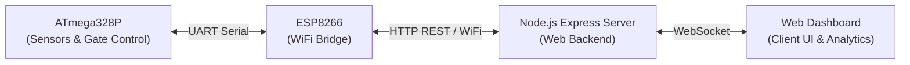

# Intelligent Dam Safety System

> Real-Time Water Level Forecasting and Automated Gate Control

A proactive, automated, and reliable embedded & IoT dam safety system designed for continuous monitoring of reservoir water levels, early flood warning, and automated gate control based on overflow risk prediction.

---

## Repository Architecture

This project is organized as a modular monorepo cleanly separating embedded firmware, hardware schematics, web dashboard, and project documentation:

```text
Dam_Safety_System/
├── docs/                               # Project reports & proposals
│   └── Group 3_Embedded_Proposal.pdf   # Semester embedded system proposal
├── firmware/                           # Embedded microcontroller & IoT source code
│   ├── atmega328p/                     # Core controller firmware (C / AVR)
│   │   └── Group3.c                    # Sensor reading & gate motor actuation
│   └── esp8266/                        # WiFi telemetry & command bridge (Arduino)
│       └── esp.ino                     # HTTP client communication with web server
├── hardware/                           # Circuit diagrams & physical PCB builds
│   ├── circuit_schematic/
│   │   └── Circuit Design.png          # System circuit schematic diagram
│   └── soldering_board_circuit/        # Physical soldered PCB & prototype photos
├── web/                                # Web dashboard & backend server
│   ├── public/                         # Frontend client (HTML, CSS, JS, Chart.js)
│   ├── .env.example                    # Environment variable template
│   ├── package.json                    # Dependencies & scripts
│   ├── server.js                       # Express & Socket.IO server
│   └── README.md                       # Web setup & API documentation
├── .gitignore                          # Standard git ignore rules (Node, AVR, OS)
└── README.md                           # Main repository guide
```

---

## System Overview



1. **ATmega328P (`firmware/atmega328p`)**: Reads water level sensors, evaluates safety thresholds (SAFE, ALARM, DANGER), and drives gate motors.
2. **ESP8266 (`firmware/esp8266`)**: Transmits live telemetry to the web backend via HTTP POST (`/api/data`) and fetches manual override commands via HTTP GET (`/api/command`).
3. **Web Dashboard (`web/`)**: Real-time monitoring dashboard with live water level charts, risk forecasting, audit logs, and an admin manual gate override.

---

## Getting Started with the Web Dashboard

If you are working on the website part:

1. Navigate to the web directory:
   ```bash
   cd web
   ```
2. Install dependencies:
   ```bash
   npm install
   ```
3. Start the development server (with auto-reload):
   ```bash
   npm run dev
   ```
4. Open [http://localhost:3000](http://localhost:3000) in your browser.

For complete API details and WebSocket events, see [web/README.md](web/README.md).

---

## Git Workflow & Branch Management

To maintain a clean and reliable codebase in collaborative development:

- `main`: Production-ready, stable codebase. Direct commits to `main` should be restricted.
- `develop`: Integration branch where tested features are merged before releasing to `main`.
- `feature/web-dashboard`: Active working branch for frontend and backend web development.
- `feature/firmware`: Feature branches for ATmega328P or ESP8266 updates.

### Creating a Feature Branch
```bash
git checkout -b feature/web-dashboard
```

### Commit Guidelines
Use semantic commit messages:
- `feat(web): add export to PDF button`
- `fix(web): resolve chart responsiveness on mobile`
- `docs: update system wiring diagram`
- `chore: update dependencies`
